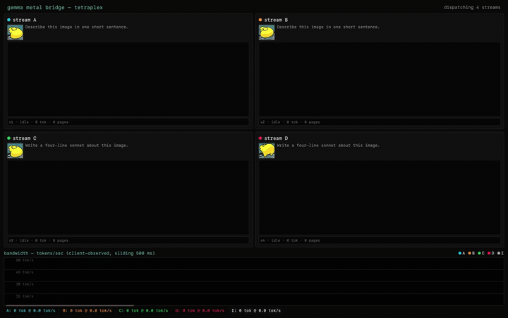
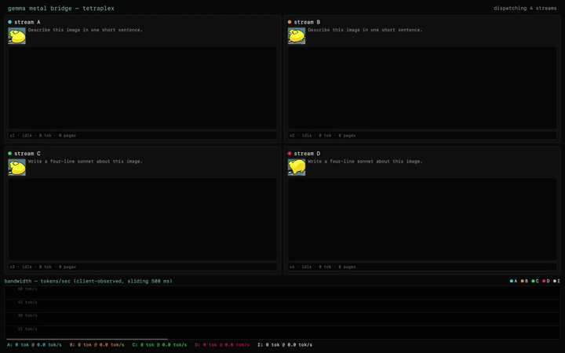

# gemma-metal

A from-scratch Metal inference engine for **Gemma-4-A4B** on Apple Silicon, exposing one OpenAI-compatible REST surface over paged attention, a content-hash prefix cache, and batched multi-session AR decode. Two kinds of clients drive it: (a) a fork of [SillyTavern](https://github.com/SillyTavern/SillyTavern) for chat-completion-shaped product testing (see [`tools/st-debug/`](tools/st-debug/) — harness + Playwright suite), and (b) bespoke engine-internals visualizers under [`server/static/`](server/static/) (tetraplex, labeler, loom, steering) for things ST does not and will not render — real-time KV-cache tenancy strips, batched 4-stream throughput timeseries, control-vector steering heatmaps. See [**docs/QUICKSTART.md**](docs/QUICKSTART.md) to run it on your M-series Mac. The two animations on this page are the same four-way multimodal workload before and after the scheduler learned to fire soft-prefill on ≥ 2 ready slots instead of all-or-nothing — a 17.3 s → 8.7 s speedup on identical hardware, weights, and kernels ([before](docs/media/tetraplex-before-multislot.mp4) / [after](docs/media/tetraplex-after-multislot.mp4) MP4s if you want higher fidelity).

> **Hammerspoon usage in this project is consent-gated.** When Claude drives the local Hammerspoon HTTP control surface (`~/.hammerspoon/init.lua` on `:27843`), the action is only permissible if a verbatim user statement authorizing that scope is recorded in [**docs/tests/hammerspoon_signoffs.md**](docs/tests/hammerspoon_signoffs.md). The capabilities exist (keystroke synthesis, focus, screen capture); their *use* requires explicit per-scope sign-off. See the memoranda for the audit trail.

## docs map

The engine, kernels, and bridge work is the foundation; the harness +
toolchain is how we iterate without burning user attention. Both kinds
of doc live under [`docs/`](docs/) — the index below points to the
ones it's worth knowing exist.

- [**docs/multi_user_agent_chat_interface_spec.md**](docs/multi_user_agent_chat_interface_spec.md) —
  Restorative spec for the bedazzled chat client. Captures peak + revisions + extrapolations.
- [**docs/project_archeology.md**](docs/project_archeology.md) —
  Indexed timeline of every chat-suggestion interface version. Cross-references commits to operator-stated specs.

### engine / kernel / performance

- [**docs/QUICKSTART.md**](docs/QUICKSTART.md) — get the bridge running
- [**docs/kernel_throughput_ceiling.md**](docs/kernel_throughput_ceiling.md) —
  where the M:K saturation story sits + what would lift the 135 tok/s ceiling
- [**docs/kv_pool_split_spec.md**](docs/kv_pool_split_spec.md) —
  half-day spec for lifting the 8192-page KV-pool cliff via 2-level
  address arithmetic
- [**docs/kv_cache_correlation_finding.md**](docs/kv_cache_correlation_finding.md)
  + [**docs/kv_cache_correlation_diagnosis.md**](docs/kv_cache_correlation_diagnosis.md) —
  the bug + the fix (RNG seed propagation, not a K/V correctness issue)

### SillyTavern-fork integration / harness

The [**`tools/st-debug/`**](tools/st-debug/) workspace is a state-free
debug-only SillyTavern instance pointing at this bridge. Lets us
validate plugins, workflows, tool-call parsing, streaming, and
DOM-vs-API content time-series autonomously — without bulk-collecting
real user sessions or making the user a copy-paste courier between
DevTools and Claude.

- [**tools/st-debug/README.md**](tools/st-debug/README.md) —
  layout + workflow
- [**docs/descendant_agent_ux_spec.md**](docs/descendant_agent_ux_spec.md) —
  UX affordances for "scringlo delegated work to a forkagent"
  scenarios (depth indicators, caption-forkagents, cross-context
  result handoff)
- [**docs/tool_elicitation_findings.md**](docs/tool_elicitation_findings.md) —
  empirical A/B study of tool descriptions; round-2 finds dual
  qualitative + syntax examples on non-overlapping topics
  outperform every alternative
- [**docs/forked_agent_patterns.md**](docs/forked_agent_patterns.md) —
  taxonomy of descendant-agent shapes (fresh sync / context-copy
  sync / fresh async / context-copy async + the orthogonal LLM-vs-
  programmatic axis); design sketches for example cards
- [**docs/toolcards_fifo_session_finding.md**](docs/toolcards_fifo_session_finding.md) —
  the FIFO sync-block bug we found in the SillyTavern-fork toolcards
  plugin via static analysis, plus the per-session-process
  refactor pair-programmed with codex

### isolation / "no leakage from the user's main install"

The st-debug harness has its own `_data/` (gitignored, regenerable)
and runs ST on port 8002. Toolcards + characters get COPIED (not
symlinked, after we caught a write-back-via-symlink leakage path) so
the debug instance never writes to `~/sillytavern-fork/data/`. See
the bootstrap script's commentary for the audit trail.
